# Caldera Engineering Framework

This repository defines how we think about engineering roles, growth, and impact at Caldera. It provides clear expectations for every level, from Software Engineer through Distinguished, along with the competencies and behaviors that drive career progression.

## What's Inside

### 📋 Role Definitions
Clear descriptions of scope, responsibilities, and expectations for each engineering level:
- **[Software Engineer](roles/software-engineer.md)** — Execute on well-defined problems
- **[Senior Software Engineer](roles/senior-software-engineer.md)** — Own features and mentor others
- **[Principal Software Engineer](roles/principal-software-engineer.md)** — Lead projects and multiply team impact
- **[Distinguished Software Engineer](roles/distinguished-software-engineer.md)** — Drive transformational initiatives
- **[Head of Engineering](roles/head-of-engineering.md)** — Lead the engineering organization

### 🎯 Core Frameworks
- **[Core Competencies](frameworks/competencies.md)** — The 10 competency areas where all engineers develop
- **[Progression Matrix](frameworks/progression-matrix.md)** — Side-by-side comparison across all levels

### 🛠️ Templates
- **[Role Template](templates/role-template.md)** — Template for creating new role definitions

---

## Our Engineering Philosophy

### Core Principles

### Growth Through Demonstration
We believe in **earning responsibilities before titles**. Engineers demonstrate readiness for the next level by consistently operating at that level. Title changes recognize what you're already doing, not unlock what you might do.

### Increasing Scope & Ownership
As engineers grow, three dimensions expand simultaneously:

#### Time Horizon — How far ahead you work

As engineers grow, their planning horizon extends significantly:

- **Software Engineer**: Work in short cycles, delivering individual features within days
- **Senior Engineer**: Coordinate across weeks, bundling related features into cohesive sets
- **Principal Engineer**: Operate on a months-long timeline, orchestrating entire projects with multiple moving parts
- **Distinguished Engineer**: Think in quarters, shaping products and strategic initiatives that define the company's direction

#### Problem Space — What you're responsible for discovering

```mermaid
flowchart LR
    P1[<b>Execution</b><br/>Problem + Solution<br/>→ Deliver]
    P2[<b>Delivery Process</b><br/>Problem + Direction<br/>→ Define & Deliver]
    P3[<b>Solution Discovery</b><br/>Problem<br/>→ Discover & Deliver]
    P4[<b>Problem Discovery</b><br/>Find Problem<br/>→ Solution → Delivery]
    P1 ==> P2 ==> P3 ==> P4

    style P1 stroke:#7c3aed,stroke-width:3px
    style P2 stroke:#7c3aed,stroke-width:3px
    style P3 stroke:#7c3aed,stroke-width:3px
    style P4 stroke:#7c3aed,stroke-width:3px
```

The scope of ambiguity you navigate expands with each level:

- **Software Engineer**: Execute with clarity—given both a problem and its solution, focus on implementation
- **Senior Engineer**: Receive a problem and direction, then define the specific solution and delivery approach
- **Principal Engineer**: Start with just the problem itself, discovering the right solution through exploration and technical investigation
- **Distinguished Engineer**: Operate at the highest level of ambiguity, identifying problems worth solving before anyone else sees them, then driving both solution and execution

#### Impact Radius — Where your work creates value

Your sphere of influence grows concentrically with experience:

- **Software Engineer**: Create value through individual tasks, focusing on discrete units of work
- **Senior Engineer**: Expand impact to entire features, connecting multiple tasks into user-facing capabilities
- **Principal Engineer**: Operate at the project level, coordinating cross-functional efforts that span teams and timelines
- **Distinguished Engineer**: Shape products and drive company-wide initiatives, influencing technical direction and organizational outcomes at the highest level

### Extreme Ownership
You own your work end-to-end. This means:
- Taking responsibility for outcomes, not just outputs
- Proactively identifying and solving problems
- Following through until value is delivered
- Asking for help when needed, but driving resolution

### Dual Impact: Client & Internal
As a consultancy, we measure success on two fronts:
- **Client Impact**: Solving real problems, delivering value, building trust
- **Internal Impact**: Strengthening our team, improving our craft, building Caldera's reputation

Both matter. Great engineers create value for clients while elevating the entire team.

### Transparency & Working in Public
We default to open:
- Share work-in-progress, not just finished products
- Document decisions and trade-offs
- Make knowledge accessible to the team
- Learn and build in the open

### Culture Building
Every engineer is a culture carrier. We actively shape Caldera through:
- How we communicate with clients and each other
- The quality bar we set
- How we mentor and support teammates
- The practices and standards we establish

### Peer Accountability
We hold each other to high standards with kindness:
- Give direct, constructive feedback
- Challenge ideas, not people
- Support each other's growth
- Celebrate wins and learn from setbacks together

---

## How This Guides Our Roles

Each role definition reflects these principles:
- **Scope expectations** are clear but not limiting
- **Behaviors** are described, not just responsibilities
- **Growth paths** show what "operating at the next level" looks like
- **Impact** is measured on both client and internal dimensions

You don't wait for a promotion to start working at the next level. You work at the next level to earn the promotion.

---

## How to Use This Framework

### For Engineers
1. Read your current role definition to understand expectations
2. Review the progression matrix to see the path ahead
3. Read the next level's role definition to understand what growth looks like
4. Use the competency framework to assess and develop yourself
5. Have career conversations with your manager using this shared language

### For Managers
1. Use role definitions to set clear expectations
2. Assess engineers against competencies at their level
3. Identify engineers consistently operating at the next level
4. Provide specific, behavioral feedback tied to the framework
5. Create opportunities for engineers to demonstrate next-level capabilities

### For Everyone
Remember: This framework makes expectations clear, but growth happens through demonstration. You earn the next level by consistently operating at that level. Title changes recognize what you're already doing.