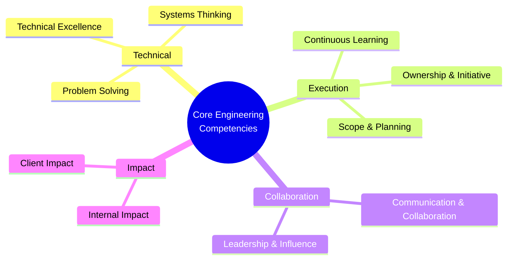

# Core Engineering Competencies

This framework defines the core competencies that span all engineering roles at Caldera. Each competency evolves as engineers grow from Software Engineer through Distinguished Engineer.

---

## Competency Framework Overview

---

## How to Use This Framework

- **Competencies** are areas where all engineers need to develop skill
- **Progression** within each competency reflects increasing scope, ownership, and impact
- **Role definitions** describe how these competencies manifest at each level
- **Growth** happens by demonstrating competency at the next level consistently

You don't need to excel at everything to grow. But you should be strong across competencies and exceptional in areas relevant to your role and impact.

---

## Competency Growth Visualization

```mermaid
graph LR
    subgraph SE[Software Engineer]
        SE1[Foundation Building]
        SE2[Following Patterns]
        SE3[Learning & Growing]
    end
    
    subgraph Senior[Senior Engineer]
        S1[Setting Standards]
        S2[Designing Solutions]
        S3[Mentoring Others]
    end
    
    subgraph Principal[Principal Engineer]
        P1[Strategic Decisions]
        P2[Complex Systems]
        P3[Team Leadership]
    end
    
    subgraph Distinguished[Distinguished Engineer]
        D1[Organizational Impact]
        D2[Strategic Vision]
        D3[Industry Leadership]
    end
    
    SE ==> Senior
    Senior ==> Principal
    Principal ==> Distinguished
    
    style SE stroke:#2563eb,stroke-width:2px
    style Senior stroke:#2563eb,stroke-width:3px
    style Principal stroke:#7c3aed,stroke-width:3px
    style Distinguished stroke:#ea580c,stroke-width:3px
```

---

## 1. Technical Excellence

The foundation of engineering work: writing excellent code, making sound technical decisions, and continuously improving craft.

### Software Engineer
- Write clean, maintainable code following team standards
- Test your work thoroughly
- Learn and apply patterns from the codebase
- Debug issues systematically
- Use development tools effectively

### Senior Software Engineer
- Write exemplary code that sets standards
- Design clear, intuitive interfaces and APIs
- Make thoughtful architectural trade-offs
- Create comprehensive test strategies
- Leave code better than you found it
- Demonstrate depth in relevant areas

### Principal Software Engineer
- Design complex systems balancing multiple concerns
- Make architectural decisions with long-term implications
- Demonstrate deep expertise in your domain(s)
- Evaluate and introduce new technologies thoughtfully
- Create technical solutions others learn from

### Distinguished Software Engineer
- Design systems and platforms that create lasting leverage
- Make strategic technology choices with company-wide impact
- Demonstrate expertise across multiple domains
- Stay at the forefront of relevant technology
- Define technical standards and best practices

---

## 2. Problem Solving

Understanding problems, finding solutions, and navigating complexity and ambiguity.

### Software Engineer
- Break down assigned tasks into steps
- Debug issues with available tools
- Research solutions using documentation
- Ask for help with context about what you've tried
- Learn from mistakes and feedback

### Senior Software Engineer
- Break down ambiguous requirements into actionable work
- Navigate complexity and find pragmatic paths
- Anticipate issues and address proactively
- Evaluate multiple solution approaches
- Balance competing concerns effectively

### Principal Software Engineer
- Tackle problems others find intractable
- Discover and define solutions to complex problems
- Navigate significant uncertainty and ambiguity
- Create clarity from chaos
- Make progress on multiple fronts simultaneously

### Distinguished Software Engineer
- Identify which problems are worth solving
- See patterns and opportunities others miss
- Frame problems in ways that enable great solutions
- Validate problems before investing in solutions
- Solve problems that create transformational value

---

## 3. Ownership & Initiative

Taking responsibility, driving outcomes, and proactively making things better.

### Software Engineer
- Take responsibility for completing assigned tasks
- Proactively communicate blockers and seek help
- Follow through on commitments
- Test your work before requesting review
- Keep tickets and status updated

### Senior Software Engineer
- Own outcomes, not just outputs
- Proactively identify and solve problems
- Drive features to completion
- Remove blockers for yourself and others
- Improve processes and code without being asked

### Principal Software Engineer
- Own success of entire projects and their outcomes
- Anticipate and address systemic issues
- Ensure projects deliver real value
- Remove obstacles for teams
- Take responsibility for technical strategy

### Distinguished Software Engineer
- Own success of multi-month initiatives
- Take responsibility for organizational technical health
- Proactively identify strategic challenges
- Create conditions for organizational success
- Ensure initiatives deliver transformational value

---

## 4. Communication & Collaboration

Sharing knowledge, working effectively with others, and building shared understanding.

### Software Engineer
- Write clear PR descriptions
- Ask clarifying questions about requirements
- Communicate progress and blockers regularly
- Participate actively in code reviews
- Contribute to team discussions

### Senior Software Engineer
- Explain technical decisions to various audiences
- Write clear documentation and ADRs
- Lead technical discussions effectively
- Give detailed, educational code reviews
- Build alignment across team members

### Principal Software Engineer
- Translate between technical and business perspectives
- Present complex topics to diverse audiences
- Build consensus across stakeholders
- Influence through clear reasoning and evidence
- Create shared context across teams

### Distinguished Software Engineer
- Influence executives, clients, and engineers effectively
- Create alignment on complex, ambiguous initiatives
- Communicate technical strategy compellingly
- Build deep understanding across different contexts
- Make strategic decisions comprehensible to all

---

## 5. Scope & Planning

Working across time horizons, breaking down work, and delivering predictably.

### Software Engineer
- Plan and execute work over 1-2 weeks
- Break tasks into manageable steps
- Estimate your own work with guidance
- Complete tasks on time
- Communicate when estimates change

### Senior Software Engineer
- Plan and deliver work over 1-3 months
- Break down features and small projects into tasks others can execute
- Estimate and sequence work across multiple weeks
- Deliver predictably and adjust plans as needed
- Think ahead to avoid surprises

### Principal Software Engineer
- Plan and deliver projects over 3-6 months
- Break complex projects into achievable milestones
- Sequence work to manage risk and dependencies
- Maintain momentum through challenges
- Create and adjust plans as conditions change

### Distinguished Software Engineer
- Plan and drive initiatives over 6-12 months
- Break transformational work into phases
- Navigate organizational dynamics in planning
- Drive multiple interdependent initiatives
- Adapt strategy while maintaining direction

---

## 6. Leadership & Influence

Growing others, shaping culture, and creating impact beyond your direct work.

### Software Engineer
- Learn from feedback and coaching
- Support teammates when you have knowledge to share
- Provide helpful code review feedback
- Ask good questions in meetings
- Contribute to positive team culture

### Senior Software Engineer
- Actively coach less experienced engineers
- Provide detailed, educational feedback
- Help others grow through pairing and guidance
- Improve team practices and processes
- Set example through your work

### Principal Software Engineer
- Make entire teams more effective
- Mentor Senior Engineers toward Principal level
- Share expertise broadly across teams
- Influence technical decisions across projects
- Shape technical culture and practices

### Distinguished Software Engineer
- Multiply effectiveness of entire organization
- Develop engineering leaders
- Influence how the company approaches technology
- Build organizational capabilities
- Shape engineering culture at company level

---

## 7. Client Impact

Understanding and serving client needs, building trust, and delivering value.

### Software Engineer
- Understand how your work serves client needs
- Deliver features that work as specified
- Consider user experience in implementations
- Take pride in shipping quality work
- Ask questions about client context

### Senior Software Engineer
- Deeply understand client problems and constraints
- Propose solutions balancing needs and quality
- Build features that exceed expectations
- Participate effectively in client discussions
- Build client trust through excellent work

### Principal Software Engineer
- Build deep, trusted relationships with client technical leaders
- Understand client business and technical strategy
- Identify opportunities for transformative impact
- Guide clients toward sound technical decisions
- Ensure delivery of exceptional value

### Distinguished Software Engineer
- Partner with clients on transformational initiatives
- Understand clients' business at strategic level
- Identify opportunities that change how clients operate
- Build relationships with client executives
- Create sustained, exceptional value

---

## 8. Internal Impact

Strengthening Caldera, building capabilities, and improving how we work.

### Software Engineer
- Learn and follow Caldera practices
- Share what you're learning with team
- Document your work for others
- Bring positive energy to interactions
- Contribute to Caldera culture

### Senior Software Engineer
- Improve team practices and processes
- Raise quality bar through example
- Share learnings across projects
- Contribute to Caldera's reputation
- Mentor newer engineers

### Principal Software Engineer
- Shape Caldera's technical culture and capabilities
- Build and document institutional knowledge
- Contribute to Caldera's technical strategy
- Strengthen practices across projects
- Develop future leaders

### Distinguished Software Engineer
- Shape Caldera's technical direction
- Build organizational capabilities
- Create lasting competitive advantage
- Represent Caldera's engineering excellence externally
- Influence Caldera's business strategy

---

## 9. Systems Thinking

Understanding how pieces fit together, considering context, and thinking holistically.

### Software Engineer
- Understand the systems you work in
- Consider how your changes impact other code
- Ask about dependencies and interactions
- Learn the broader context of your work
- Think beyond just your immediate task

### Senior Software Engineer
- Understand how systems interact and impact each other
- Consider second-order effects of changes
- Think about full lifecycle of features
- Balance local optimization with global impact
- Connect technical work to user and business value

### Principal Software Engineer
- Understand complex interactions across systems and teams
- Consider technical, organizational, and business constraints
- Think in capabilities and platforms, not just features
- Anticipate cascading effects of decisions
- Balance system-wide health with local needs

### Distinguished Software Engineer
- Understand interactions across technical, organizational, and business systems
- Design solutions accounting for human and organizational factors
- Think in organizational capabilities
- See how technical decisions impact strategy
- Create conditions for long-term organizational success

---

## 10. Continuous Learning

Growing your skills, staying current, and adapting to change.

### Software Engineer
- Actively learn from codebase and teammates
- Seek and incorporate feedback
- Learn new technologies and tools as needed
- Ask questions and build understanding
- Grow your craft deliberately

### Senior Software Engineer
- Stay current in relevant technologies
- Learn from multiple sources and contexts
- Share knowledge and learning with team
- Adapt quickly to new contexts and technologies
- Develop depth in chosen areas

### Principal Software Engineer
- Stay at forefront of relevant technology
- Bring external knowledge to Caldera
- Evaluate new technologies and practices
- Learn quickly in new domains
- Teach others what you learn

### Distinguished Software Engineer
- Monitor and evaluate technology landscape
- Identify emerging trends and implications
- Integrate knowledge across domains
- Learn what you need to know rapidly
- Contribute to industry knowledge

---

## Using These Competencies

### For Individual Engineers
- Assess where you are in each competency
- Identify areas to develop for next level
- Seek opportunities to practice growing competencies
- Discuss competency development with manager

### For Managers
- Use competencies to assess readiness for next level
- Provide specific feedback tied to competencies
- Create opportunities for competency development
- Recognize when engineers demonstrate next-level competencies

### For the Organization
- Competencies create shared language for growth
- Framework makes expectations clear and consistent
- Enables fair, transparent advancement decisions
- Helps identify and develop future leaders

