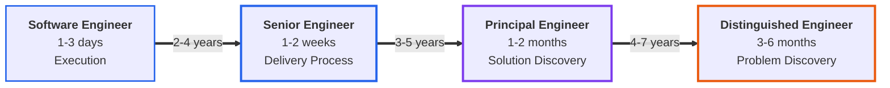
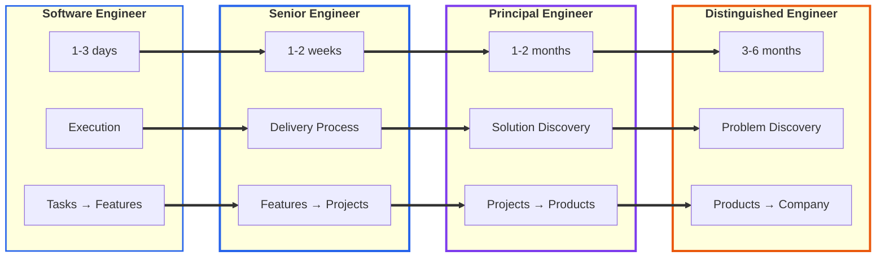
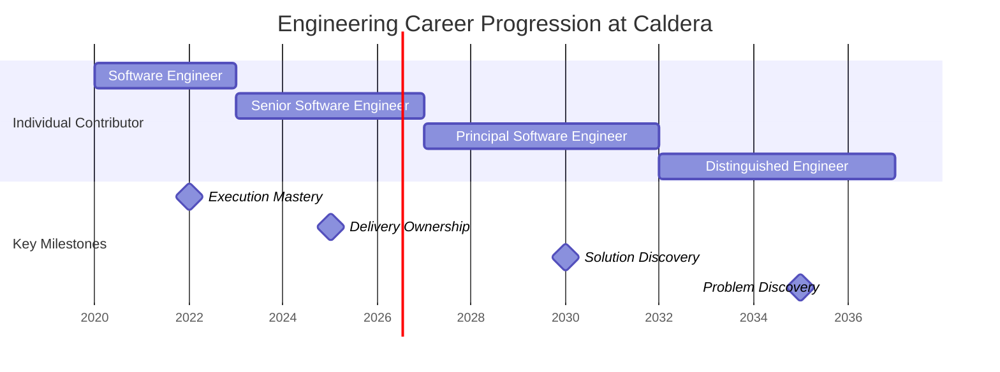
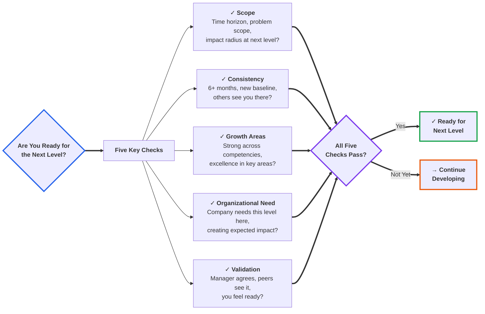

# Engineering Progression Matrix

This matrix provides a side-by-side comparison of how expectations evolve across engineering levels. Use this to understand the trajectory of growth and identify where you are on the path.

---

## Engineering Progression Overview

## Core Dimensions

| Dimension | Software Engineer | Senior Software Engineer | Principal Software Engineer | Distinguished Software Engineer |
|-----------|-------------------|-------------------------|----------------------------|--------------------------------|
| **Time Horizon** | 1-3 days (features) | 1-2 weeks (feature sets) | 1-2 months (projects) | 3-6 months (products/initiatives) |
| **Problem Space** | Execution: Given problem + solution | Delivery Process: Given problem + direction | Solution Discovery: Given problem | Problem Discovery: Find the problem |
| **Impact Radius** | Tasks → Features | Features → Projects | Projects → Products | Products → Company |
| **Autonomy** | Guided execution | Independent delivery | Strategic ownership | Organizational leadership |

---

## Expanding Scope Across Dimensions

---

## Competency Progression

### Technical Excellence

| Level | What It Looks Like |
|-------|-------------------|
| **Software Engineer** | Write clean, maintainable code following standards. Test thoroughly. Apply patterns from codebase. Debug systematically. |
| **Senior** | Write exemplary code that sets standards. Design clear APIs. Make architectural trade-offs. Leave code better than found. |
| **Principal** | Design complex systems balancing multiple concerns. Make long-term architectural decisions. Deep domain expertise. |
| **Distinguished** | Design platforms creating lasting leverage. Make strategic technology choices with company-wide impact. Multi-domain expertise. |

### Problem Solving

| Level | What It Looks Like |
|-------|-------------------|
| **Software Engineer** | Break down tasks into steps. Debug with available tools. Research solutions. Ask for help effectively. |
| **Senior** | Break down ambiguous requirements. Navigate complexity pragmatically. Anticipate and address issues proactively. |
| **Principal** | Tackle intractable problems. Discover and define solutions. Navigate significant uncertainty. Create clarity from chaos. |
| **Distinguished** | Identify which problems are worth solving. See patterns others miss. Frame problems enabling great solutions. |

### Ownership & Initiative

| Level | What It Looks Like |
|-------|-------------------|
| **Software Engineer** | Take responsibility for tasks. Communicate blockers. Follow through on commitments. Test before review. |
| **Senior** | Own outcomes, not just outputs. Drive features to completion. Remove blockers. Improve processes proactively. |
| **Principal** | Own success of projects and outcomes. Address systemic issues. Ensure delivery of real value. |
| **Distinguished** | Own multi-month initiatives. Responsible for organizational technical health. Create conditions for success. |

### Communication & Collaboration

| Level | What It Looks Like |
|-------|-------------------|
| **Software Engineer** | Write clear PR descriptions. Ask clarifying questions. Communicate progress. Participate in code reviews. |
| **Senior** | Explain decisions to various audiences. Write clear documentation. Lead technical discussions. Educational code reviews. |
| **Principal** | Translate between technical and business. Present complex topics clearly. Build consensus across stakeholders. |
| **Distinguished** | Influence executives, clients, and engineers. Create alignment on complex initiatives. Communicate strategy compellingly. |

### Leadership & Influence

| Level | What It Looks Like |
|-------|-------------------|
| **Software Engineer** | Learn from feedback. Support teammates. Provide helpful code reviews. Ask good questions. Positive culture contribution. |
| **Senior** | Actively coach less experienced engineers. Provide detailed feedback. Help others grow. Improve team practices. Set example. |
| **Principal** | Make teams more effective. Mentor Senior Engineers. Share expertise broadly. Influence decisions across projects. |
| **Distinguished** | Multiply organizational effectiveness. Develop leaders. Influence company's approach to technology. Build capabilities. |

### Client Impact

| Level | What It Looks Like |
|-------|-------------------|
| **Software Engineer** | Understand how work serves clients. Deliver as specified. Consider user experience. Ship quality work. |
| **Senior** | Deeply understand client problems. Propose balanced solutions. Exceed expectations. Build trust through excellence. |
| **Principal** | Build trusted relationships with client technical leaders. Understand client strategy. Identify transformative opportunities. |
| **Distinguished** | Partner on transformational initiatives. Understand business at strategic level. Change how clients operate. Build executive relationships. |

### Internal Impact

| Level | What It Looks Like |
|-------|-------------------|
| **Software Engineer** | Learn and follow practices. Share learnings. Document work. Bring positive energy. Contribute to culture. |
| **Senior** | Improve team practices. Raise quality bar. Share learnings across projects. Build Caldera's reputation. Mentor engineers. |
| **Principal** | Shape technical culture and capabilities. Build institutional knowledge. Contribute to strategy. Strengthen practices. |
| **Distinguished** | Shape technical direction. Build organizational capabilities. Create competitive advantage. Represent excellence externally. |

---

## Growth Indicators by Level

### Moving from Software Engineer → Senior

**You're ready when you consistently:**
- Complete features (not just tasks) independently
- Think 1-2 weeks ahead, not just current task
- Propose solutions, not just implement them
- Take responsibility for feature success
- Anticipate problems before blockers
- Help unblock teammates proactively
- Influence team practices through contributions
- Understand trade-offs in technical decisions

**Time typically:** 2-4 years, but demonstrate readiness, don't wait for time

### Moving from Senior → Principal

**You're ready when you consistently:**
- Plan and deliver month-long projects
- Own solution discovery, not just delivery
- Influence technical strategy across projects
- Think about long-term technical health
- Guide architecture for team/product
- Develop other engineers effectively
- Solve problems spanning teams
- Known for specific expertise

**Time typically:** 3-5 years at Senior, requires demonstrated strategic impact

### Moving from Principal → Distinguished

**You're ready when you consistently:**
- Operate on 3-6 month timelines
- Discover problems, not just solutions
- Influence technical direction at company level
- Build capabilities serving many projects
- Develop other Principal Engineers
- Shape what problems we solve
- Create leverage across entire company
- Recognized as expert beyond Caldera

**Time typically:** 4-7 years at Principal, rare role requiring transformational impact

---

## Career Growth Timeline

*Note: Timeline is illustrative. Progression is based on demonstrated capability, not time in role.*

---

## Key Transitions

```mermaid
flowchart LR
    Start([<b>Career Growth Path</b>])

    SE[<b>Software Engineer</b><br/>Execution Focus]
    SE_Work[Given: Problem + Solution<br/>You: Implement & Deliver]

    Senior[<b>Senior Software Engineer</b><br/>Delivery Ownership]
    Senior_Work[Given: Problem + Direction<br/>You: Define & Deliver Solution]

    Principal[<b>Principal Software Engineer</b><br/>Solution Discovery]
    Principal_Work[Given: Problem<br/>You: Discover, Define & Deliver]

    Distinguished[<b>Distinguished Software Engineer</b><br/>Problem Discovery]
    Distinguished_Work[You: Find Problem<br/>+ Solution + Delivery]

    Start ==> SE
    SE --> SE_Work
    SE_Work ==>|Demonstrate ownership<br/>Propose solutions<br/>Break down work| Senior
    Senior --> Senior_Work
    Senior_Work ==>|Explore solutions<br/>Design systems<br/>Mentor others| Principal
    Principal --> Principal_Work
    Principal_Work ==>|Identify problems<br/>Build capabilities<br/>Shape strategy| Distinguished
    Distinguished --> Distinguished_Work

    style SE stroke:#2563eb,stroke-width:2px
    style Senior stroke:#2563eb,stroke-width:3px
    style Principal stroke:#7c3aed,stroke-width:3px
    style Distinguished stroke:#ea580c,stroke-width:3px
```

### From Execution to Ownership (SE → Senior)

**What Changes:**
- **Before:** Given problem and solution → implement
- **After:** Given problem and direction → define and deliver solution

**How to Prepare:**
- Start proposing solutions for your tasks
- Think about the "why" behind features
- Break down your own work without guidance
- Help design features, not just implement them

### From Delivery to Discovery (Senior → Principal)

**What Changes:**
- **Before:** Given problem → define and deliver solution
- **After:** Given problem → discover, define, and deliver solution

**How to Prepare:**
- Explore solution space before proposing
- Design systems, not just features
- Think in terms of projects and platforms
- Lead technical strategy for features
- Mentor Senior Engineers

### From Solution to Problem Discovery (Principal → Distinguished)

**What Changes:**
- **Before:** Given problem → discover solution
- **After:** Find the problem → solution → delivery

**How to Prepare:**
- Identify problems worth solving
- Connect technical work to business strategy
- Build organizational capabilities
- Think on multi-month horizons
- Shape company technical direction

---

## Decision Framework: Are You Ready?

Ask yourself these questions:

### Scope
- Am I consistently operating at the next level's time horizon?
- Do I own problems at the next level's scope?
- Is my impact radius expanding to the next ring?

### Consistency
- Have I demonstrated this for 6+ months?
- Is this my new baseline, not occasional spikes?
- Do others see me operating at this level?

### Growth Areas
- Am I strong across all core competencies?
- Do I have areas of excellence relevant to the next level?
- Have I addressed any significant gaps?

### Organizational Need
- Does Caldera need someone operating at this level in this area?
- Am I creating the kind of impact expected at this level?
- Would my promotion reflect reality or hope?

### Validation
- Does my manager see me operating at this level?
- Do peers and stakeholders treat me as if I'm already there?
- Do I feel ready for the expanded scope and responsibility?

**Remember:** You work at the next level to earn the promotion. The promotion recognizes what you're already doing, it doesn't unlock what you might do.

---

## Common Misconceptions

### ❌ "I need to wait for a promotion to do bigger work"
✅ Take on bigger work to earn the promotion. Show you're ready by doing it.

### ❌ "I'm Senior because I have 5 years experience"
✅ You're Senior when you consistently demonstrate Senior competencies, regardless of time.

### ❌ "I excel technically, so I should advance"
✅ Technical excellence is necessary but not sufficient. All competencies matter.

### ❌ "I do everything my level requires, so I should be promoted"
✅ Promotion requires consistently operating at the next level, not maximizing current level.

### ❌ "Principal/Distinguished is about being the best coder"
✅ Higher levels are about strategic impact, leadership, and organizational multiplication.

---

## Using This Matrix

### For Self-Assessment
1. Identify your current level
2. Look at next level expectations
3. Assess where you are in each competency
4. Create development plan for gaps
5. Seek opportunities to demonstrate readiness

### For Managers
1. Assess engineers against their current level
2. Identify engineers operating at next level
3. Provide specific feedback tied to competencies
4. Create opportunities for growth
5. Recognize and promote when ready

### For Career Conversations
1. Use matrix to create shared understanding
2. Identify specific growth areas
3. Define what "operating at next level" means
4. Set clear milestones
5. Track progress over time

---

## Additional Resources

- **Role Definitions:** See individual role documents for detailed expectations
- **Competency Framework:** See competencies.md for detailed competency descriptions
- **Philosophy:** See main README.md for underlying principles
- **Role Template:** See templates/role-template.md for consistent structure

